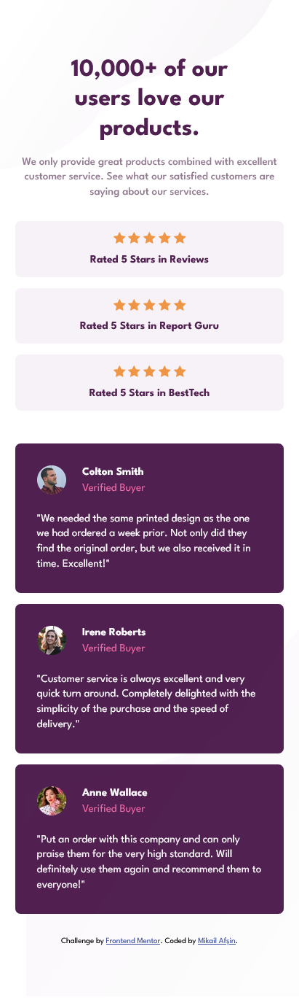
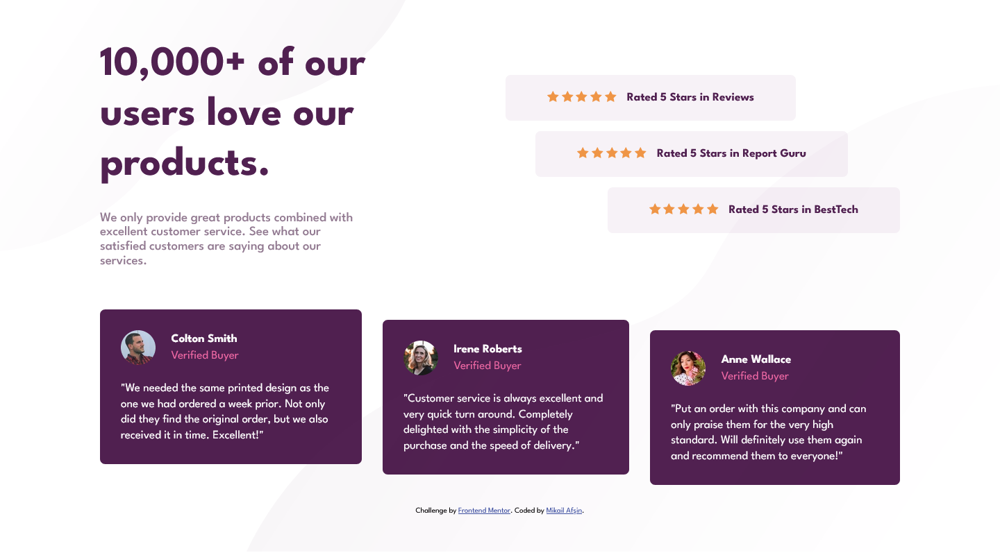

# Frontend Mentor - Social proof section solution

This is a solution to the [Social proof section challenge on Frontend Mentor](https://www.frontendmentor.io/challenges/social-proof-section-6e0qTv_bA).

## Table of contents

- [Overview](#overview)
  - [The challenge](#the-challenge)
  - [Screenshot](#screenshot)
  - [Links](#links)
- [My process](#my-process)
  - [Built with](#built-with)
  - [What I learned](#what-i-learned)
  - [Continued development](#continued-development)
- [Author](#author)

## Overview

### The challenge

Users should be able to:

- View the optimal layout for the section depending on their device's screen size

### Screenshot

**Mobile**


**Desktop**


### Links

- Solution URL: [GitHub](https://github.com/mikailafsin/frontend-mentor-social-proof-section-solution)
- Live Site URL: [Vercel](https://frontend-mentor-social-proof-section-solution-two.vercel.app)

## My process

### Built with

- HTML5 markup
- CSS custom properties
- Flexbox
- Mobile-first workflow

### What I learned

Actually, in this challenge, as in the previous challenge, I reinforced the use of two separate images for both mobile and desktop views for responsive design.

```html
<div class="social-proof-bg-pattern-top-mobile">
  
</div>
<div class="social-proof-bg-pattern-top-desktop">
  
</div>
.
.
.
.
.
<div class="social-proof-bg-pattern-bottom-mobile">
  
</div>
<div class="social-proof-bg-pattern-bottom-desktop">
  
</div>
```
**Mobile Css**
```css
.social-proof-bg-pattern-top-desktop,
.social-proof-bg-pattern-bottom-desktop {
    display: none;
}
```

**Desktop Css**
```css
.social-proof-bg-pattern-top-desktop,
.social-proof-bg-pattern-bottom-desktop {
        display: block;
        position: absolute;
        z-index: -1;
    }
```

### Continued development

In future projects, I will implement the use of separate images for both mobile and desktop views, which I had the chance to reinforce in this and previous challenges.

## Author

- Frontend Mentor - [@mikailafsin](https://www.frontendmentor.io/profile/mikailafsin)
- Instagram - [@mikail.afsin](https://www.instagram.com/mikail.afsin)